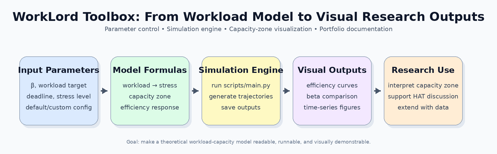
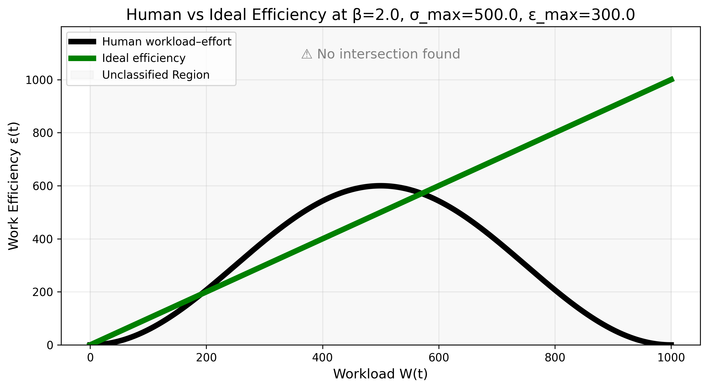
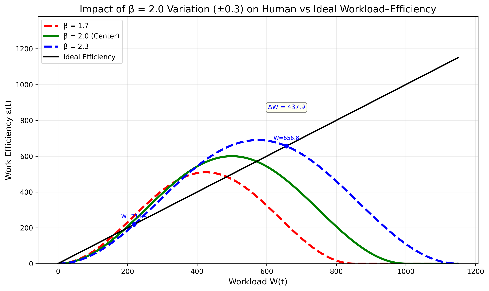
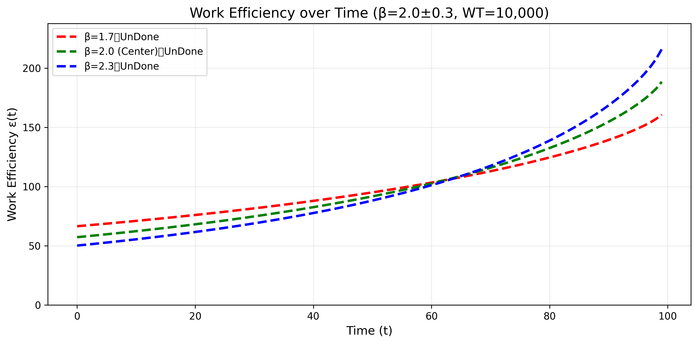
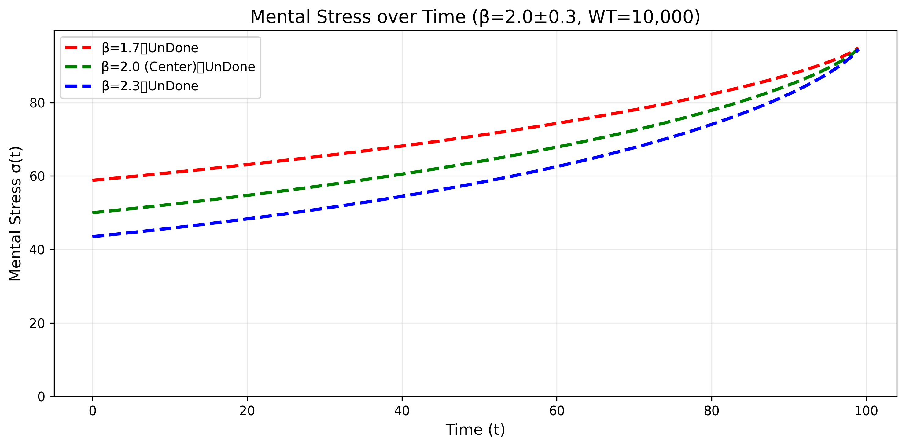

# WorkLord Toolbox

**A Python research software prototype for workload modeling, human capacity-zone simulation, and visual analytics.**

**Portfolio version by Yinpeng Su**  
GitHub: [YinpengSu-Concordia](https://github.com/YinpengSu-Concordia)  
LinkedIn: [Yinpeng Su](https://www.linkedin.com/in/yinpeng-su-4626a0369/)

---

## 1. Project Overview

WorkLord Toolbox translates a theoretical workload-capacity model into a runnable Python simulation workflow. It generates workload-efficiency curves, beta-variation comparisons, and time-series visualizations of work efficiency and stress.

This repository is presented as a recent research software portfolio project. It focuses on computational modeling, reproducible simulation, visual explanation, and potential applications in human factors engineering and human-autonomy teaming.



---

## 2. What This Project Does

The toolbox helps explore questions such as:

- When does workload improve work efficiency?
- When does workload exceed the human capacity zone?
- How does the beta parameter shift the efficiency curve?
- How do efficiency and stress evolve over time under different assumptions?
- How can workload modeling support future adaptive task allocation in human-autonomy teaming?

At a high level, the workflow is:

```text
Input Parameters
    ↓
Workload / Stress / Capacity Formulas
    ↓
Simulation Engine
    ↓
Generated Figures
    ↓
Research Interpretation
```

---

## 3. Example Outputs

### 3.1 Workload-Efficiency Relationship

This figure shows the relationship between workload and work efficiency. The main idea is that extremely low workload and excessive workload can both reduce effective performance, while a middle capacity zone may support better efficiency.



### 3.2 Beta-Variation Comparison

This figure compares how changes in the beta parameter affect the workload-efficiency curve. It helps visualize how different assumptions about human capacity or workload sensitivity can shift the effective working range.



### 3.3 Work Efficiency Over Time

This time-series output shows how work efficiency evolves during a simulated task process under different beta assumptions.



### 3.4 Stress Over Time

This figure shows the simulated stress trajectory over time. Together with the efficiency curve, it provides a way to reason about workload allocation, fatigue risk, and human performance limits.



---

## 4. How to Use the Toolbox

### 4.1 Clone the Repository

```bash
git clone https://github.com/YinpengSu-Concordia/WorkLord-Toolbox.git
cd WorkLord-Toolbox
```

### 4.2 Create a Virtual Environment

```bash
python -m venv .venv
```

Windows PowerShell:

```powershell
.\.venv\Scripts\Activate.ps1
```

macOS / Linux:

```bash
source .venv/bin/activate
```

### 4.3 Install Dependencies

```bash
pip install -r requirements.txt
```

### 4.4 Run the Main Workflow

```bash
python scripts/main.py
```

The console will ask whether to use default parameters or custom parameters. Generated figures will be saved under:

```text
results/figures/
```

### 4.5 Run Individual Replication Scripts

The `reproduce_code/` folder contains figure-level scripts for reproducing specific model outputs.

Example:

```bash
python reproduce_code/simulation_figure3.py
python reproduce_code/simulation_figure10.py
```

This is useful when checking or extending one specific figure rather than running the full workflow.

---

## 5. How to Interpret the Outputs

The generated figures are visual outputs and model interpretation tools at the same time.

| Output Type | What It Shows | Why It Matters |
|---|---|---|
| Workload-efficiency curve | Relationship between workload and effective performance | Helps identify the capacity zone |
| Beta-variation comparison | Sensitivity of the model under different beta values | Shows how capacity assumptions affect the optimal range |
| Efficiency over time | Simulated performance trajectory during task execution | Useful for reasoning about productivity and workload scheduling |
| Stress over time | Simulated stress trajectory during task execution | Useful for fatigue-risk and human performance discussion |

In a human-autonomy teaming context, this type of model can support future research on adaptive task allocation. A future system could use similar logic to avoid both underloading and overloading the human operator.

---

## 6. Main Features

- Workload-efficiency curve generation
- Capacity Zone / Fatigue Zone visualization
- Beta-variation comparison under different mental-capacity assumptions
- Time-series simulation of work efficiency and stress
- Modular Python structure for formula computation, simulation orchestration, and visualization
- Reproducible scripts for figure-level model replication
- Lightweight dependency stack suitable for ordinary laptops

---

## 7. Project Structure

```text
WorkLord-Toolbox/
├── config/                 # Default simulation parameters
├── docs/                   # Project documentation and portfolio materials
│   └── assets/             # README images and visual explanation assets
├── environment/            # Detailed environment notes
├── reproduce_code/         # Figure-level replication scripts
├── results/figures/        # Example generated figures
├── results/logs/           # Runtime logs, ignored except .gitkeep
├── scripts/                # Main entry point
├── workload_code/          # Core implementation modules
├── requirements.txt        # Python dependencies
├── CITATION.cff            # Citation metadata
├── LICENSE                 # Portfolio-use license notice
└── README.md
```

---

## 8. Technical Stack

- Python 3.9–3.12
- NumPy
- Matplotlib
- Typing Extensions
- pathlib-based cross-platform file handling

---

## 9. My Contribution

This repository focuses on the software implementation and research-tooling layer:

- structured Python modules for formulas, analysis utilities, simulation orchestration, visualization, and user interaction;
- configurable simulation parameters;
- automatic figure generation;
- reproducible scripts for model replication and extension;
- documentation and presentation materials summarizing the replication workflow;
- visual README design for portfolio demonstration.

This project demonstrates my ability to:

- translate a mathematical research model into runnable software;
- organize research code into a maintainable Python package structure;
- create reproducible visual outputs;
- document assumptions, parameters, and model limitations;
- connect human factors theory with computational simulation.

---

## 10. Attribution

The original theoretical model and paper are attributed to:

> Mengting Zhao, Dongyu Qiu, and Yong Zeng, “How much workload is a ‘good’ workload for human beings to meet the deadline: human capacity zone and workload equilibrium,” *Journal of Engineering Design*.

This repository does **not** claim authorship of the original theory. My contribution is the Python implementation, engineering structure, replication workflow, visualization pipeline, and portfolio documentation.

---

## 11. Suggested Future Extensions

- Add unit tests for formula-level validation;
- Add a command-line interface with named parameters;
- Add Jupyter notebooks for research demonstrations;
- Add empirical data calibration once workload or psychophysiological data become available;
- Extend the model toward adaptive workload allocation in human-autonomy teaming.

---

# WorkLord Toolbox 中文说明

**一个用于工作负荷建模、人类能力区模拟与可视化分析的 Python 研究软件原型。**

**作品集版本：Yinpeng Su**  
GitHub: [YinpengSu-Concordia](https://github.com/YinpengSu-Concordia)  
LinkedIn: [Yinpeng Su](https://www.linkedin.com/in/yinpeng-su-4626a0369/)

---

## 1. 项目概述

WorkLord Toolbox 的目标，是把一个关于工作负荷、压力、人类能力区与工作效率关系的理论模型，转化成一个可以运行、可以调参、可以生成图像的 Python 仿真工具。

这个仓库作为近期 research software portfolio 展示，重点体现计算建模、可复现仿真、图像化解释，以及未来在人因工程和人机协同研究中的应用潜力。


---

## 2. 这个项目用来做什么

这个工具箱可以帮助探索以下问题：

- 工作负荷在什么时候会提高工作效率？
- 工作负荷在什么时候会超过人的能力区？
- beta 参数如何改变工作负荷与效率之间的关系？
- 工作效率和压力如何随着任务过程变化？
- 工作负荷模型如何支持未来的人机协同任务分配研究？

整体流程可以理解为：

```text
输入参数
    ↓
工作负荷 / 压力 / 能力区公式
    ↓
仿真引擎
    ↓
自动生成图像
    ↓
研究解释与模型分析
```

---

## 3. 可视化结果展示

### 3.1 工作负荷与效率关系图

这张图展示工作负荷和工作效率之间的关系。核心含义是：过低的工作负荷和过高的工作负荷都会降低有效表现，而中间的能力区可能支持更好的效率。


### 3.2 beta 参数变化对比图

这张图比较 beta 参数变化对工作负荷—效率曲线的影响。它可以展示不同能力假设或敏感度假设如何改变有效工作区间。


### 3.3 工作效率随时间变化图

这张时间序列图展示在模拟任务过程中，工作效率如何随时间变化。


### 3.4 压力随时间变化图

这张图展示模拟压力轨迹。结合效率曲线，可以用于讨论工作负荷分配、疲劳风险和人类表现边界。


---

## 4. 如何使用这个工具箱

### 4.1 克隆仓库

```bash
git clone https://github.com/YinpengSu-Concordia/WorkLord-Toolbox.git
cd WorkLord-Toolbox
```

### 4.2 创建虚拟环境

```bash
python -m venv .venv
```

Windows PowerShell:

```powershell
.\.venv\Scripts\Activate.ps1
```

macOS / Linux:

```bash
source .venv/bin/activate
```

### 4.3 安装依赖

```bash
pip install -r requirements.txt
```

### 4.4 运行主程序

```bash
python scripts/main.py
```

程序会在命令行中询问使用默认参数，还是输入自定义参数。生成的图像会保存到：

```text
results/figures/
```

### 4.5 单独运行某一张图的复现脚本

`reproduce_code/` 文件夹中包含按图像编号组织的复现脚本。

示例：

```bash
python reproduce_code/simulation_figure3.py
python reproduce_code/simulation_figure10.py
```

这种方式适合单独检查或扩展某一张模型图。

---

## 5. 如何理解这些图像

这些图像既是可视化结果，也是模型解释工具。

| 输出类型 | 展示内容 | 研究意义 |
|---|---|---|
| 工作负荷—效率曲线 | 工作负荷与有效表现之间的关系 | 用于识别人类能力区 |
| beta 参数变化对比 | 不同 beta 值下模型的敏感性 | 展示能力假设如何影响最优区间 |
| 工作效率时间序列 | 任务过程中效率的变化轨迹 | 用于分析生产率和工作负荷安排 |
| 压力时间序列 | 任务过程中压力的变化轨迹 | 用于讨论疲劳风险和人类表现边界 |

在人机协同场景中，这类模型可以支持未来关于自适应任务分配的研究。系统可以基于类似逻辑，避免操作者长期处于过低负荷或过高负荷状态。

---

## 6. 主要功能

- 生成工作负荷—效率曲线
- 可视化 Capacity Zone / Fatigue Zone
- 比较不同 mental capacity 假设下的 beta 参数变化
- 模拟工作效率和压力随时间变化
- 使用模块化 Python 结构组织公式、仿真和可视化代码
- 提供图像级别的可复现脚本
- 依赖轻量，适合普通笔记本运行

---

## 7. 项目结构

```text
WorkLord-Toolbox/
├── config/                 # 默认仿真参数
├── docs/                   # 项目文档与作品集材料
│   └── assets/             # README 图片与视觉说明材料
├── environment/            # 环境配置说明
├── reproduce_code/         # 按图像编号组织的复现脚本
├── results/figures/        # 示例生成图像
├── results/logs/           # 运行日志目录
├── scripts/                # 主入口程序
├── workload_code/          # 核心实现模块
├── requirements.txt        # Python 依赖
├── CITATION.cff            # 引用元数据
├── LICENSE                 # 作品集用途说明
└── README.md
```

---

## 8. 技术栈

- Python 3.9–3.12
- NumPy
- Matplotlib
- Typing Extensions
- pathlib 跨平台路径处理

---

## 9. 我的贡献

这个仓库重点展示软件实现和研究工具构建层面的工作：

- 组织公式、分析工具、仿真调度、可视化和用户交互模块；
- 设置可配置的仿真参数；
- 自动生成研究图像；
- 提供可复现和可扩展的脚本；
- 整理复现流程文档和展示材料；
- 将 README 改造成适合作品集展示的视觉化说明页面。

这个项目可以展示我的以下能力：

- 将数学研究模型转化为可运行软件；
- 将研究代码组织为可维护的 Python 项目结构；
- 生成可复现的图像化结果；
- 说明模型假设、参数和边界；
- 将人因工程理论与计算仿真连接起来。

---

## 10. 理论来源说明

原始理论模型和论文来源为：

> Mengting Zhao, Dongyu Qiu, and Yong Zeng, “How much workload is a ‘good’ workload for human beings to meet the deadline: human capacity zone and workload equilibrium,” *Journal of Engineering Design*.

本仓库**不**声称拥有原始理论的作者身份。我的贡献是 Python 实现、工程结构、复现流程、可视化管线和作品集文档整理。

---

## 11. 后续扩展方向

- 为公式层级验证添加单元测试；
- 增加可传参的命令行界面；
- 增加 Jupyter Notebook 版本，方便研究展示；
- 在获得工作负荷或生理信号数据后进行实证校准；
- 将模型扩展到人机协同中的自适应工作负荷分配研究。
